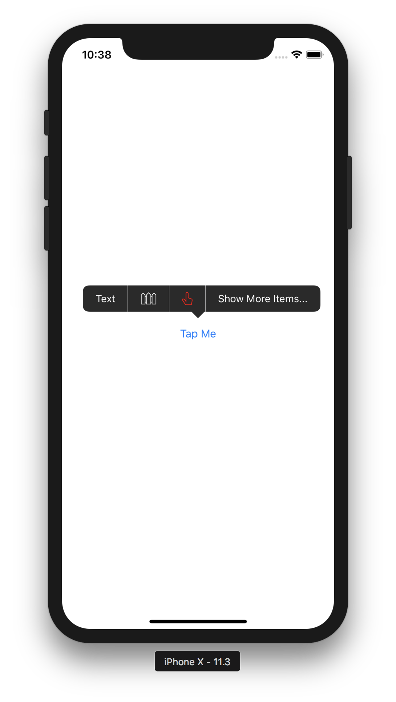

# MenuItemKit

`MenuItemKit` provides image and block(closure) support for `UIMenuItem`.  




## How to use

1. Add the `MenuItemKit` repository as a submodule of your application’s repository.
2. Drag and drop `MenuItemKit.xcodeproj` into your application’s Xcode project or workspace.
3. On the “General” tab of your application target’s settings, add `MenuItemKit.framework` to the “Embedded Binaries” section.

If you would prefer to use Carthage or CocoaPods, please pull request.

`MenuItemKit` is very easy to adopt, it provides only 2 APIs:

``` swift
extension UIMenuItem {
    convenience init(title: String, handler: MenuItemHandler)
    convenience init(image: UIImage, handler: MenuItemHandler)
}
```

Just init `UIMenuItem`s via those 2 APIs and set them to `menuItems` of `UIMenuItemController`. `MenuItemKit` will take care of the rest parts, you don't need to add any code related to responder chain in your view or view controller.

`MenuItemKit` is a Swift project but Objective-C is supported without a doubt.

## About Me

* Twitter: [@_cxa](https://twitter.com/_cxa)
* Apps available in App Store: <http://lazyapps.com>
* PayPal: xianan.chen+paypal 📧 gmail.com, buy me a cup of coffee if you find it's useful for you.

## License

`MenuItemKit` is released under the MIT license. In short, it's royalty-free but you must keep the copyright notice in your code or software distribution.
